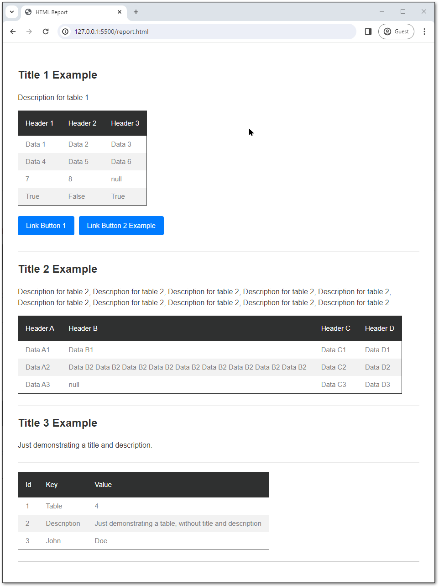

# HTML Report Generator

This C# program provides a simple HTML report generator that allows you to create HTML reports with tables and buttons. It includes interfaces for defining report components and a class for generating HTML reports.

> It can only generate the html, nothing more.

## Features
- Multiple tables with:
  - Title
  - Description
  - Table
    - Converts null, numbers, booleans, text to string
    - Things it does not understand will be displayed as: `[Error Convertion]`
  - Buttons, with Text and URL
- Ok support for Email formatting

## Table of Contents

- [Interfaces](#interfaces)
- [Usage](#usage)
- [Installation](#install)
- [Example](#example)

## Report preview



## Interfaces <a name="interfaces"></a>

```csharp
public interface IReportButton
{
    string ButtonText { get; set; }
    string ButtonUrl { get; set; }
}

public interface IReportTable
{
    string Title { get; set; }
    string Description { get; set; }
    string[] TableHeaders { get; }
    List<string[]> TableBody { get; }
    IReportButton[]? Buttons { get; set; } // Nullable array of IReportButton
    void AddTableRecord(params object[] rowData);
    void AddTableHeader(params string[] headers);
}

public interface IReportPage
{
    IReportTable[] Tables { get; set; }
}
```

## Usage <a name="usage"></a>

1. Define the tables and their contents using `ReportTable` instances.
2. Optionally, define buttons using `ReportButton` instances and associate them with tables.
3. Create a `ReportPage` object and assign the tables to its `Tables` property.
4. Use the `HtmlReportGenerator` to generate the HTML report using the `GenerateReport` method, passing the `ReportPage` object as a parameter.

## Installation <a name="install"></a>
1. Copy the file `HtmlReportHelper.cs` into your project.
2. Use the examples below as starting point

## Example 1<a name="example"></a>

```csharp
// Define tables and buttons
var table1 = new ReportTable();
table1.Title = "Table 1";
table1.Description = "Description for Table 1";
table1.AddTableHeader("Header 1", "Header 2", "Header 3");
table1.AddTableRecord("Data A1", "Data B1", "Data C1");
// Add more rows and buttons as needed...

// Create a report page and assign tables
var reportPage = new ReportPage { Tables = new IReportTable[] { table1 /*, other tables...*/ } };

// Generate HTML report
var reportGenerator = new HtmlReportGenerator();
string htmlReport = reportGenerator.GenerateReport(reportPage);
```

## Example 2

```csharp
// TABLE 1

var table1 = new ReportTable();
table1.Title = "Table 1";
table1.Description = "This is table 1";
table1.AddTableHeader("Header 1", "Header 2", "Header 3");

table1.AddTableRecord("Data 1", "Data 2", "Data 3"); // null value is treated as empty string
table1.AddTableRecord("Data 4", "Data 5", "Data 6");
table1.AddTableRecord(7, 8, null); // numbers are converted to string
table1.AddTableRecord(true, false, true); // booleans are converted to string

// TABLE 1 - BUTTONS (Optional)

table1.Buttons = new IReportButton[]
{
    new ReportButton { ButtonText = "Button 1", ButtonUrl = "https://example.com/button1" },
    new ReportButton { ButtonText = "Button 2", ButtonUrl = "https://example.com/button2" }
};

// TABLE 2

var table2 = new ReportTable();
table2.Title = "Table 2";
table2.Description = "This is table 2";
table2.AddTableHeader("Header A", "Header B", "Header C");

table2.AddTableRecord("Data A1", "Data B1", "Data C1");
table2.AddTableRecord("Data A2", "Data B2 Data B2 Data B2 Data B2 Data B2 Data B2 Data B2 Data B2 Data B2 ", "Data C2");
table2.AddTableRecord("Data A3", null, "Data C3"); // null value is treated as empty string

// Creating Report Page

var reportPage = new ReportPage
{
    Tables = new IReportTable[] { table1, table2 }
};

// Generating HTML report
var reportGenerator = new HtmlReportGenerator();
string htmlReport = reportGenerator.GenerateReport(reportPage);
```

---

## Todo:
- Its late, refactor to root folder.
- Add a AddButton() Method to ReportTable
- Make sure table is optional